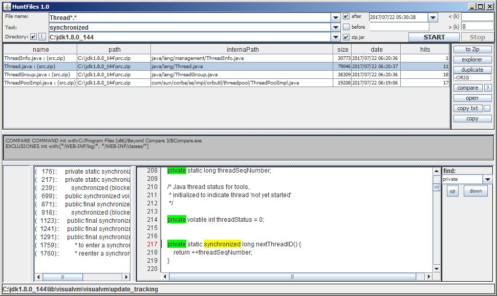
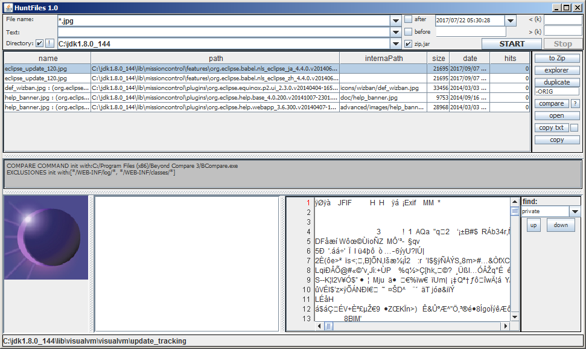

# huntfiles

A tool to search files in local directories.

It can search inside zip, jar, rar and 7z archives.

Found text is shown highlighted

# execute :  
java -jar dist/huntfiles-0.1-boot.jar

java -jar dist/huntfiles-0.1-boot.jar --dir "c:/temp" --text "hello you" --file "*.txt" --zip

--help for options.

# or 
(context menu) huntfiles-0.1-boot.jar ,  open with java

screenshots:

